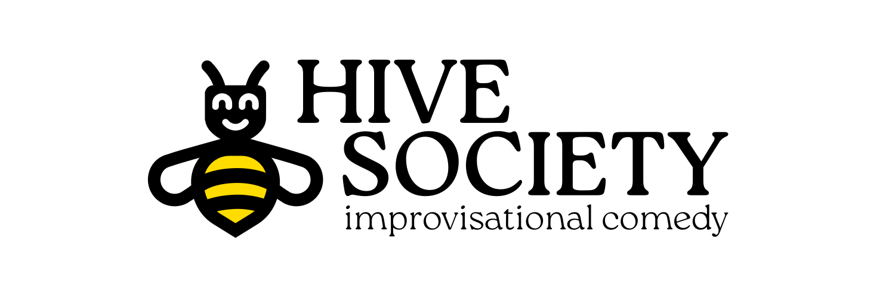

# Foreword

Dear reader,

Welcome to the Beeble, the beating heart of Hive Society Improv. Within these pages exists the collected wisdom of Hive's past, guidance for its present, and aspirations for its future. May the Beeble serve as both our compass and our anchor, connecting us to the past and guiding us towards what comes next.  Most of all, may it serve as a living document; just as Hive is alive, so should these words be. Feel empowered to take this document into your hands and make it your own. As a group, together, build on our collective story. Correct where we went wrong, and add where you went right. 

Each new era of Hive Society stands on the shoulders of those who came before. Every team, old and new, is held aloft by the wisdom of their seniors—both of those who remain and of those who've graduated, those who've gone out into the world to live their wonderful, beautiful lives. 

Hive Society is not just an improv group, nor is it a mere collection of them. It is a community and a home, a place for camaraderie and connection. Perhaps most of all, it is a living, breathing thing; a thing that stretches and grows with every new scene, show, and team. Our approach to improv is unique, but our love for it is not. We believe that improvisational comedy is not just an art form, but a way of life—a way of thinking and interacting with the world around you. May the Beeble serve as a guide to that way of life, and may it be a testament to the love and joy that we find in it.

Welcome to the Beeble. Welcome to Hive Society. Welcome to the hive mind.

<!-- Break legs, To the laughs we've yet to share, -->

I've got your back,\
Lukas "Kukas" Unguraitis\
*Hive Society Improv, Class of 2025*
