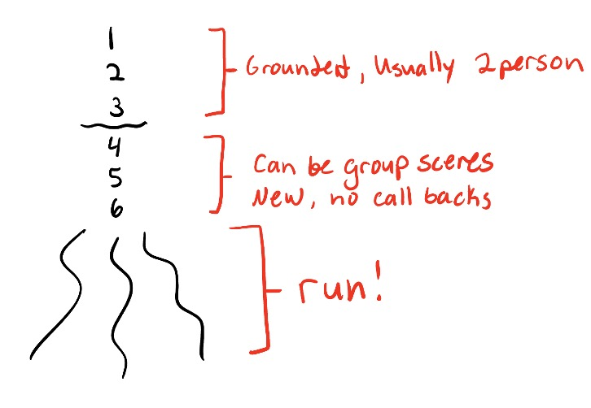

# Expansion Tree

\
*Image by Jamie Ziah.*

An expansion tree is a sweep-based[^1] set built around a more free-form structure with the aim of developing and escalating multiple storylines. This is typically the second set taught to new teams. It is generally considered to be easier than an [armando](armando.md). The general structure is as follows:

---

*Audience suggestion (usually of 'grab-bag anything') is taken.*

**Source scenes** (•••) ~2m x 3 = ~6m

- Usually these are 2-person scenes
- Meant to establish the beginnings of storylines to be built upon and called back to

**Source scenes** (•••) ~2m x 3 = ~6m

- Can be group scenes
- Should be new and unrelated to the first set of scenes

**The Run** (•...) ~8m

- Keep the scenes shorter and faster paced and try to build
- This is where the real *expansion* happens—expand upon and escalate storylines
  - Connecting storylines is advanced and fun but not a requirement, expanding is the only real rule

Total: ~20m

---

[^1]: Scenes are ended by a performer running across the stage while shouting "Sweep!" and then starting a new scene. The people in the scene they are sweeping leave the stage. The person who swept then becomes a part of the new scene.